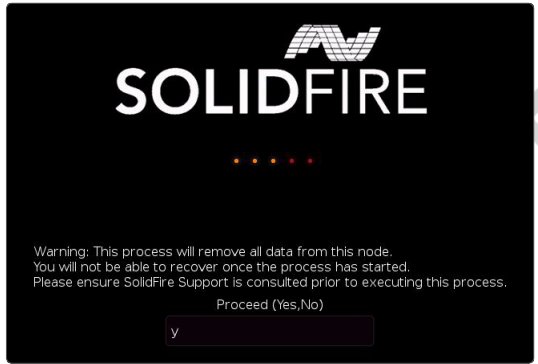

= Eseguire il processo RTFI
:allow-uri-read: 

È possibile avviare il processo RTFI (Return to Factory Image) interagendo con il nodo tramite i prompt della console di testo che vengono visualizzati prima dell'avvio del sistema.

WARNING: Il processo RTFI è distruttivo per i dati e cancella in modo sicuro tutti i dati e i dettagli di configurazione dal nodo e installa un nuovo sistema operativo.  Verificare che il nodo utilizzato per il processo RTFI non sia attivo come parte di un cluster.

Il processo RTFI esegue le seguenti operazioni di alto livello:

. Avvia l'installazione dopo la conferma dell'utente e convalida l'immagine.
. Sblocca tutte le unità su un nodo.
. Convalida e aggiorna il firmware.
. Controlla l'hardware.
. Testa l'hardware.
. Cancella in modo sicuro tutte le unità selezionate.
. Partiziona l'unità radice e crea file system.
. Monta e decomprime l'immagine.
. Configura il nome host, la rete (Dynamic Host Configuration Protocol), la configurazione predefinita del cluster e il bootloader GRUB.
. Arresta tutti i servizi, raccoglie i registri e riavvia.

Per configurare il nodo dopo il completamento con successo del processo RTFI, vedere https://docs.netapp.com/us-en/element-software/index.html["documentazione per la versione del software Element"^] .  Dopo che un nodo ha completato con successo il processo RTFI, passa per impostazione predefinita allo stato _disponibile_ (non configurato).

== Eseguire il processo RTFI

Per ripristinare il software Element sul nodo SolidFire , utilizzare la seguente procedura.

Per informazioni sulla creazione di una chiave USB o sull'utilizzo del BMC per eseguire il processo RTFI, vederexref:task_rtfi_deployment_and_install_options.adoc[Opzioni di distribuzione e installazione RTFI] .

.Prima di iniziare
Verifica di soddisfare i seguenti requisiti:

* Hai accesso a una console per il nodo SolidFire .
* Il nodo su cui si sta eseguendo il processo RTFI è acceso e connesso a una rete.
* Il nodo su cui si sta eseguendo il processo RTFI non fa parte di un cluster attivo.
* Hai accesso al supporto di installazione avviabile che contiene l'immagine della versione del software Element pertinente alla tua configurazione.

In caso di dubbi prima di eseguire il processo RTFI, contattare l'assistenza NetApp .

.Passi
. Collegare un monitor e una tastiera sul retro del nodo oppure connettersi all'interfaccia utente IP BMC e richiamare la console *iKVM/HTML5* dalla scheda *Controllo remoto* nell'interfaccia utente.
. Inserire una chiavetta USB con un'immagine appropriata in uno dei due slot USB sul retro del nodo.
. Accendere o ripristinare l'alimentazione del nodo.  Durante l'avvio, selezionare il dispositivo di avvio premendo *F11*:
+

NOTE: È necessario premere *F11* più volte in rapida successione perché la schermata del dispositivo di avvio scorre rapidamente.

. Nel menu di selezione del dispositivo di avvio, evidenziare l'opzione USB.
+
Le opzioni visualizzate dipendono dalla marca USB utilizzata.

+
[NOTE]
====
Se non sono elencati dispositivi USB, accedere al BIOS, verificare che l'USB sia elencato nell'ordine di avvio, riavviare e riprovare.

Se il problema persiste, accedi al BIOS, vai alla scheda *Salva ed esci*, seleziona *Ripristina impostazioni predefinite ottimizzate*, accetta e salva le impostazioni e riavvia.

====
. Viene visualizzato un elenco delle immagini presenti sul dispositivo USB evidenziato.  Selezionare la versione desiderata e premere Invio per avviare il processo RTFI.
+
Vengono visualizzati il nome e il numero di versione del software Element dell'immagine RTFI.

. Al prompt iniziale, ti verrà comunicato che il processo rimuoverà tutti i dati dal nodo e che i dati non saranno recuperabili dopo l'inizio del processo.  Inserisci *Sì* per iniziare.
+

WARNING: Tutti i dati e i dettagli di configurazione vengono cancellati definitivamente dal nodo dopo l'avvio del processo.  Se scegli di non procedere, verrai indirizzato alxref:task_rtfi_options_menu.html[Menu delle opzioni RTFI] .

+

NOTE: Se si desidera visualizzare la console durante il processo RTFI, è possibile premere i tasti *ALT+F8* per passare alla modalità dettagliata della console.  Premere *ALT+F7* per tornare alla GUI principale.

. Inserire *No* quando viene richiesto di eseguire test hardware approfonditi, a meno che non si abbia motivo di sospettare un guasto hardware o non si riceva l'indicazione di eseguire i test dal supporto NetApp .
+
Un messaggio indica che il processo RTFI è terminato e il sistema si spegne.

. Se necessario, rimuovere tutti i supporti di installazione avviabili dopo lo spegnimento del nodo.
+
Il nodo è ora pronto per essere acceso e configurato.  Vedi il https://docs.netapp.com/us-en/element-software/setup/concept_setup_overview.html["Documentazione di archiviazione della configurazione del software Element"^] per configurare il nodo di archiviazione.

+
Se hai riscontrato un messaggio di errore durante il processo RTFI, vedixref:task_rtfi_options_menu.html[Menu delle opzioni RTFI] .

== Trova maggiori informazioni

* https://docs.netapp.com/us-en/element-software/index.html["Documentazione del software SolidFire ed Element"]
* https://docs.netapp.com/sfe-122/topic/com.netapp.ndc.sfe-vers/GUID-B1944B0E-B335-4E0B-B9F1-E960BF32AE56.html["Documentazione per le versioni precedenti dei prodotti NetApp SolidFire ed Element"^]

