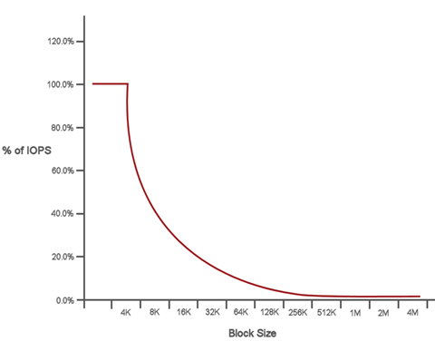

= Prestazioni e qualità del servizio
:allow-uri-read: 
:icons: font
:imagesdir: ../media/

[role="lead"]
Un cluster di storage SolidFire è in grado di fornire parametri di qualità del servizio (QoS) in base al volume.  È possibile garantire le prestazioni del cluster misurate in input e output al secondo (IOPS) utilizzando tre parametri configurabili che definiscono la QoS: IOPS minimi, IOPS massimi e IOPS a raffica.

NOTE: SolidFire Active IQ dispone di una pagina di raccomandazioni QoS che fornisce consigli sulla configurazione ottimale e sull'impostazione delle impostazioni QoS.

== Parametri di qualità del servizio

I parametri IOPS sono definiti nei seguenti modi:

* *IOPS minimi*: il numero minimo di input e output sostenuti al secondo (IOPS) che il cluster di storage fornisce a un volume.  Il valore Min IOPS configurato per un volume rappresenta il livello di prestazioni garantito per un volume.  Le prestazioni non scendono al di sotto di questo livello.
* *IOPS massimi*: il numero massimo di IOPS sostenuti che il cluster di storage fornisce a un volume.  Quando i livelli IOPS del cluster sono estremamente elevati, questo livello di prestazioni IOPS non viene superato.
* *Burst IOPS* - Numero massimo di IOPS consentiti in uno scenario di burst breve.  Se un volume è stato eseguito al di sotto del numero massimo di IOPS, vengono accumulati crediti burst.  Quando i livelli di prestazioni diventano molto elevati e vengono spinti al massimo, sul volume sono consentiti brevi raffiche di IOPS.
+
Il software Element utilizza Burst IOPS quando un cluster è in esecuzione in uno stato di basso utilizzo degli IOPS del cluster.

+
Un singolo volume può accumulare Burst IOPS e utilizzare i crediti per superare i propri Max IOPS fino al livello Burst IOPS per un "periodo di burst" impostato.  Un volume può subire un burst fino a 60 secondi se il cluster ha la capacità di gestire il burst.  Un volume accumula un secondo di credito burst (fino a un massimo di 60 secondi) per ogni secondo in cui il volume viene eseguito al di sotto del limite Max IOPS.

+
I burst IOPS sono limitati in due modi:

+
** Un volume può superare il suo massimo IOPS per un numero di secondi pari al numero di crediti burst accumulati dal volume.
** Quando un volume supera l'impostazione Max IOPS, è limitato dall'impostazione Burst IOPS.  Pertanto, il burst IOPS non supera mai l'impostazione burst IOPS per il volume.

* *Larghezza di banda massima effettiva* - La larghezza di banda massima viene calcolata moltiplicando il numero di IOPS (in base alla curva QoS) per la dimensione IO.
+
Esempio: le impostazioni dei parametri QoS pari a 100 IOPS minimi, 1000 IOPS massimi e 1500 IOPS burst hanno i seguenti effetti sulla qualità delle prestazioni:

+
** I carichi di lavoro sono in grado di raggiungere e sostenere un massimo di 1000 IOPS finché non si manifesta sul cluster la condizione di contesa del carico di lavoro per gli IOPS.  Gli IOPS vengono quindi ridotti in modo incrementale finché gli IOPS su tutti i volumi rientrano negli intervalli QoS designati e la contesa per le prestazioni viene alleviata.
** Le prestazioni su tutti i volumi sono spinte verso il valore minimo di IOPS pari a 100.  I livelli non scendono al di sotto dell'impostazione Min IOPS, ma potrebbero rimanere superiori a 100 IOPS quando la contesa del carico di lavoro viene alleviata.
** Le prestazioni non sono mai superiori a 1000 IOPS, né inferiori a 100 IOPS per un periodo prolungato.  Sono consentite prestazioni pari a 1500 IOPS (Burst IOPS), ma solo per i volumi che hanno accumulato crediti burst eseguendo al di sotto del Max IOPS e sono consentite solo per brevi periodi di tempo.  I livelli di burst non sono mai sostenuti.

== Limiti del valore QoS

Ecco i possibili valori minimi e massimi per QoS.

[cols="7*"]
|===
| Parametri | Valore minimo | Predefinito | 4 4KB | 5 8KB | 6 16KB | 262 KB 

| IOPS minimi | 50 | 50 | 15.000 | 9.375* | 5556* | 385* 

| IOPS massimi | 100 | 15.000 | 200.000** | 125.000 | 74.074 | 5128 

| IOPS a raffica | 100 | 15.000 | 200.000** | 125.000 | 74,074 | 5128 
|===
*Queste stime sono approssimative.  **I valori Max IOPS e Burst IOPS possono essere impostati fino a 200.000; tuttavia, questa impostazione è consentita solo per superare efficacemente il limite delle prestazioni di un volume.  Le prestazioni massime reali di un volume sono limitate dall'utilizzo del cluster e dalle prestazioni per nodo.

== Prestazioni QoS

La curva delle prestazioni QoS mostra la relazione tra la dimensione del blocco e la percentuale di IOPS.

Le dimensioni dei blocchi e la larghezza di banda hanno un impatto diretto sul numero di IOPS che un'applicazione può ottenere.  Il software Element tiene conto delle dimensioni dei blocchi che riceve normalizzandole a 4k.  In base al carico di lavoro, il sistema potrebbe aumentare le dimensioni dei blocchi. Con l'aumentare delle dimensioni dei blocchi, il sistema aumenta la larghezza di banda fino al livello necessario per elaborare blocchi di dimensioni maggiori.  Con l'aumento della larghezza di banda, il numero di IOPS che il sistema è in grado di raggiungere diminuisce.

La curva delle prestazioni QoS mostra la relazione tra l'aumento delle dimensioni dei blocchi e la diminuzione della percentuale di IOPS:

Ad esempio, se le dimensioni dei blocchi sono 4k e la larghezza di banda è 4000 KBps, gli IOPS sono 1000.  Se le dimensioni dei blocchi aumentano a 8k, la larghezza di banda aumenta a 5000 KBps e gli IOPS diminuiscono a 625.  Tenendo conto delle dimensioni dei blocchi, il sistema garantisce che i carichi di lavoro a priorità inferiore che utilizzano dimensioni dei blocchi più elevate, come i backup e le attività dell'hypervisor, non assorbano troppe prestazioni necessarie al traffico a priorità superiore che utilizza dimensioni dei blocchi più piccole.

== Criteri QoS

Un criterio QoS consente di creare e salvare un'impostazione di qualità del servizio standardizzata che può essere applicata a molti volumi.

Le policy QoS sono ideali per gli ambienti di servizio, ad esempio con server di database, applicazioni o infrastrutture che si riavviano raramente e necessitano di un accesso costante e paritario allo storage.  La QoS per volume individuale è ideale per le VM con utilizzo leggero, come desktop virtuali o VM specializzate di tipo chiosco, che possono essere riavviate, accese o spente quotidianamente o più volte al giorno.

QoS e policy QoS non devono essere utilizzati insieme.  Se si utilizzano criteri QoS, non utilizzare QoS personalizzati su un volume.  La QoS personalizzata sovrascriverà e regolerà i valori dei criteri QoS per le impostazioni QoS del volume.

NOTE: Per utilizzare i criteri QoS, il cluster selezionato deve essere Element 10.0 o versione successiva; in caso contrario, le funzioni dei criteri QoS non saranno disponibili.

== Trova maggiori informazioni

* https://docs.netapp.com/us-en/element-software/index.html["Documentazione del software SolidFire ed Element"]

