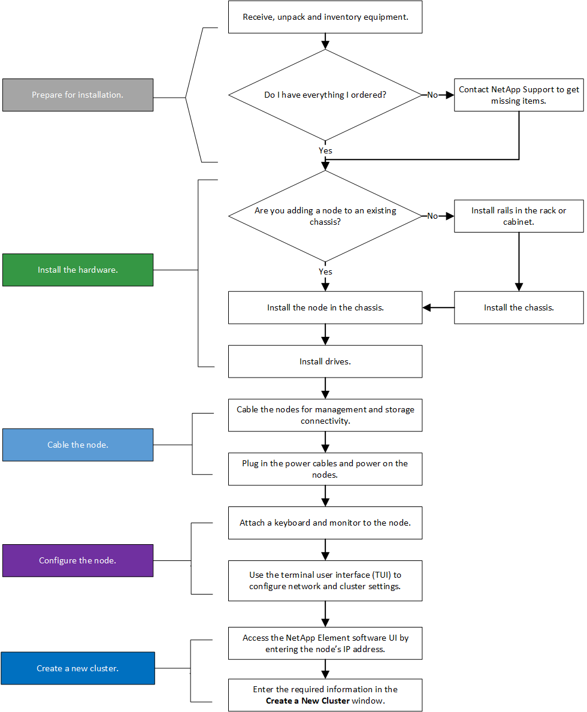
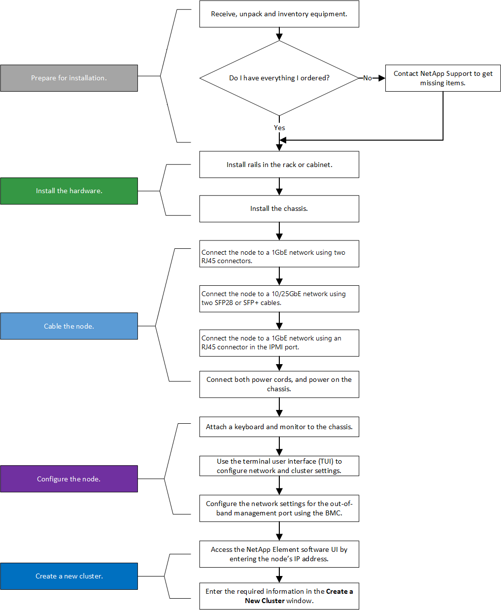
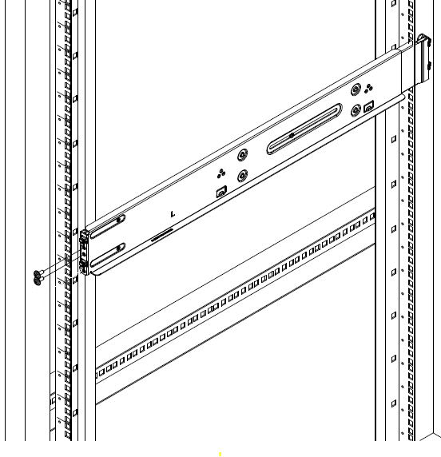
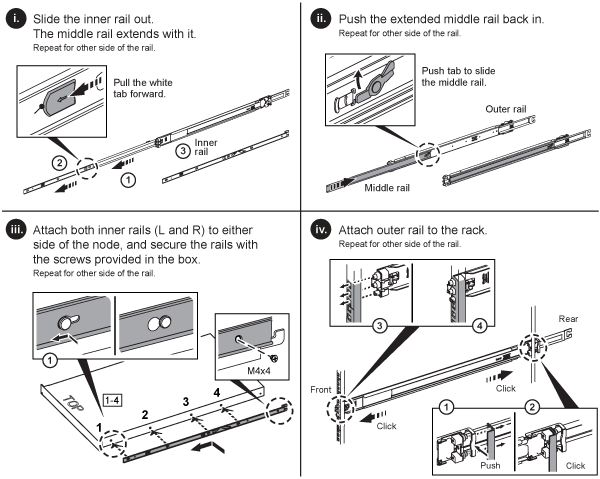
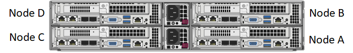
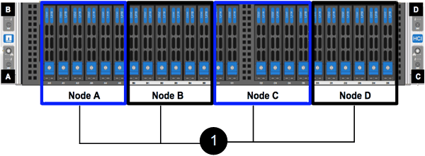
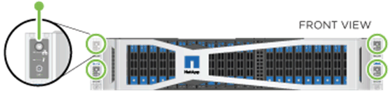
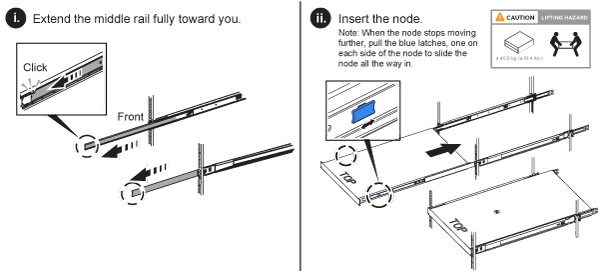
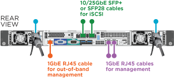
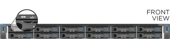

= Installare nodi di archiviazione della serie H
:allow-uri-read: 
:icons: font
:imagesdir: ../media/

[role="lead"]
Prima di iniziare a utilizzare il sistema di archiviazione all-flash, è necessario installare e configurare correttamente i nodi di archiviazione.

TIP: Vedi illink:../media/hseries_isi.pdf["poster"^] per una rappresentazione visiva delle istruzioni.

* <<Diagrammi di flusso di lavoro>>
* <<Prepararsi per l'installazione>>
* <<Installare le rotaie>>
* <<Installare e cablare i nodi>>
* <<Configurare i nodi>>
* <<Creare un cluster>>

== Diagrammi di flusso di lavoro

I diagrammi del flusso di lavoro qui riportati forniscono una panoramica generale dei passaggi di installazione.  I passaggi variano leggermente a seconda del modello della serie H.

=== H410S

=== H610S

NOTE: Nel caso di H610S, i termini "nodo" e "chassis" vengono utilizzati in modo intercambiabile, perché nodo e chassis non sono componenti separati, a differenza di uno chassis 2U a quattro nodi.

== Prepararsi per l'installazione

In preparazione all'installazione, fai un inventario dell'hardware che ti è stato spedito e contatta l'assistenza NetApp se uno qualsiasi degli elementi risulta mancante.

Assicurarsi di avere i seguenti elementi nel luogo di installazione:

* Spazio rack per il sistema.

[cols="2*"]
|===
| Tipo di nodo | spazio rack 

| Nodi H410S | Due unità rack (2U) 

| Nodi H610S | Un'unità rack (1U) 
|===
* Cavi o transceiver a collegamento diretto SFP28/SFP+
* Cavi CAT5e o superiori con connettore RJ45
* Uno switch tastiera, video, mouse (KVM) per configurare il tuo sistema
* Chiavetta USB (facoltativa)

TIP: L'hardware che ti verrà spedito dipenderà da ciò che ordini.  Un nuovo ordine da 2U a quattro nodi include lo chassis, la cornice, il kit di guide di scorrimento, le unità, i nodi di archiviazione e i cavi di alimentazione (due per chassis).  Se si ordinano i nodi di archiviazione H610S, le unità vengono fornite installate nello chassis.

CAUTION: Durante l'installazione dell'hardware, assicurarsi di rimuovere tutto il materiale di imballaggio e la pellicola dall'unità.  Ciò impedirà il surriscaldamento e lo spegnimento dei nodi.

== Installare le rotaie

L'ordine hardware che ti è stato spedito include un set di guide di scorrimento.  Per completare l'installazione della guida sarà necessario un cacciavite.  I passaggi di installazione variano leggermente per ogni modello di nodo.

TIP: Installare l'hardware dal basso verso l'alto del rack per evitare che l'apparecchiatura si ribalti.  Se il rack include dispositivi di stabilizzazione, installarli prima di installare l'hardware.

* <<H410S>>
* <<H610S>>

=== H410S

I nodi H410S sono installati in chassis H-Series 2U a quattro nodi, forniti con due set di adattatori.  Se si desidera installare il telaio in un rack con fori rotondi, utilizzare gli adattatori adatti per rack con fori rotondi.  Le guide per i nodi H410S si adattano a rack con profondità compresa tra 29 e 33,5 pollici.  Quando la rotaia è completamente contratta, è lunga 28 pollici e le sezioni anteriore e posteriore della rotaia sono tenute insieme da una sola vite.

CAUTION: Se si installa il telaio su una guida completamente contratta, le sezioni anteriore e posteriore della guida potrebbero separarsi.

.Passi
. Allineare la parte anteriore della guida con i fori sul montante anteriore del rack.
. Spingere i ganci sulla parte anteriore della guida nei fori sul montante anteriore del rack e poi verso il basso, finché i perni a molla non scattano nei fori del rack.
. Fissare la guida al rack con le viti.  Ecco un'illustrazione del binario sinistro fissato alla parte anteriore del rack:
+

. Estendere la sezione posteriore della guida fino al montante posteriore del rack.
. Allineare i ganci sul retro della rotaia con i fori appropriati sul montante posteriore, assicurandosi che la parte anteriore e quella posteriore della rotaia siano allo stesso livello.
. Montare la parte posteriore della guida sul rack e fissarla con le viti.
. Eseguire tutti i passaggi sopra descritti per l'altro lato del rack.

=== H610S

Ecco un'illustrazione per l'installazione delle guide per un nodo di archiviazione H610S:

TIP: L'H610S è dotato di binari sinistro e destro.  Posizionare il foro della vite verso il basso in modo che la vite a testa zigrinata H610S possa fissare il telaio alla guida.

== Installare e cablare i nodi

Installare il nodo di archiviazione H410S in uno chassis 2U a quattro nodi.  Per H610S, installare lo chassis/nodo direttamente sulle guide del rack.

CAUTION: Rimuovere tutto il materiale di imballaggio e la pellicola dall'unità.  Ciò impedisce che i nodi si surriscaldino e si spengano.

* <<H410S>>
* <<H610S>>

=== H410S

.Passi
. Installare i nodi H410S nello chassis.  Ecco un esempio di vista posteriore di uno chassis con quattro nodi installati:
+

+

WARNING: Prestare attenzione quando si solleva l'hardware e lo si installa nel rack.  Un telaio vuoto da due unità rack (2U) e quattro nodi pesa 54,45 libbre (24,7 kg) e un nodo pesa 8,0 libbre (3,6 kg).

. Installare le unità.
+

. Cablare i nodi.
+

IMPORTANT: Se le prese d'aria sul retro del telaio sono bloccate da cavi o etichette, si possono verificare guasti prematuri dei componenti dovuti al surriscaldamento.

+
image::../media/hci_isi_storage_cabling.png[Questa figura mostra il cablaggio di un nodo di archiviazione H410S.]

+
** Collegare due cavi CAT5e o superiori nelle porte A e B per la connettività di gestione.
** Collegare due cavi SFP28/SFP+ o transceiver nelle porte C e D per la connettività di archiviazione.
** (Facoltativo, consigliato) collegare un cavo CAT5e alla porta IPMI per la connettività di gestione fuori banda.

. Collegare i cavi di alimentazione ai due alimentatori per chassis e inserirli nella PDU da 240 V o nella presa di corrente.
. Accendere i nodi.
+

NOTE: L'avvio del nodo richiede circa sei minuti.

+

=== H610S

.Passi
. Installare il telaio H610S.  Ecco un'illustrazione per l'installazione del nodo/chassis nel rack:
+

+

WARNING: Prestare attenzione quando si solleva l'hardware e lo si installa nel rack.  Un telaio H610S pesa 40,5 libbre (18,4 kg).

. Cablare i nodi.
+

IMPORTANT: Se le prese d'aria sul retro del telaio sono bloccate da cavi o etichette, si possono verificare guasti prematuri dei componenti dovuti al surriscaldamento.

+

+
** Collegare il nodo a una rete 10/25GbE utilizzando due cavi SFP28 o SFP+.
** Collegare il nodo a una rete 1GbE utilizzando due connettori RJ45.
** Collegare il nodo a una rete 1GbE utilizzando un connettore RJ-45 nella porta IPMI.
** Collegare entrambi i cavi di alimentazione al nodo.

. Accendere i nodi.
+

NOTE: L'avvio del nodo richiede circa cinque minuti e 30 secondi.

+

== Configurare i nodi

Dopo aver installato e cablato l'hardware, sei pronto per configurare la tua nuova risorsa di archiviazione.

.Passi
. Collegare una tastiera e un monitor al nodo.
. Nell'interfaccia utente del terminale (TUI) visualizzata, configurare le impostazioni di rete e cluster per il nodo utilizzando la navigazione sullo schermo.
+

NOTE: Dovresti ottenere l'indirizzo IP del nodo dalla TUI.  Questa informazione è necessaria quando si aggiunge il nodo a un cluster.  Dopo aver salvato le impostazioni, il nodo si trova in uno stato di attesa e può essere aggiunto a un cluster.  Vedere <inserire collegamento alla sezione Configurazione>.

. Configurare la gestione fuori banda utilizzando Baseboard Management Controller (BMC).  Questi passaggi si applicano *solo ai nodi H610S*.
+
.. Utilizzare un browser Web e accedere all'indirizzo IP BMC predefinito: 192.168.0.120
.. Accedi utilizzando *root* come nome utente e *calvin* come password.
.. Dalla schermata di gestione del nodo, vai su *Impostazioni* > *Impostazioni di rete* e configura i parametri di rete per la porta di gestione fuori banda.

TIP: Vedere https://kb.netapp.com/Advice_and_Troubleshooting/Hybrid_Cloud_Infrastructure/NetApp_HCI/How_to_access_BMC_and_change_IP_address_on_H610S["questo articolo della Knowledge Base (è richiesto l'accesso)"] .

== Creare un cluster

Dopo aver aggiunto il nodo di archiviazione all'installazione e configurato la nuova risorsa di archiviazione, sei pronto per creare un nuovo cluster di archiviazione

.Passi
. Da un client sulla stessa rete del nodo appena configurato, accedi all'interfaccia utente del software NetApp Element immettendo l'indirizzo IP del nodo.
. Immettere le informazioni richieste nella finestra **Crea un nuovo cluster**. Vedi illink:../setup/concept_setup_overview.html["panoramica della configurazione"^] per maggiori informazioni.

== Trova maggiori informazioni

* https://docs.netapp.com/us-en/element-software/index.html["Documentazione del software SolidFire ed Element"]
* https://docs.netapp.com/sfe-122/topic/com.netapp.ndc.sfe-vers/GUID-B1944B0E-B335-4E0B-B9F1-E960BF32AE56.html["Documentazione per le versioni precedenti dei prodotti NetApp SolidFire ed Element"^]

