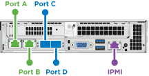
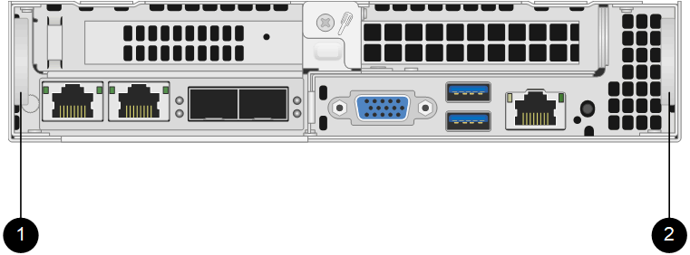

= Sostituire un nodo H410S
:allow-uri-read: 
:icons: font
:imagesdir: ../media/

[role="lead"]
È necessario sostituire un nodo di archiviazione in caso di guasto della CPU, problemi alla scheda Radian, altri problemi alla scheda madre o se non si accende.  Le istruzioni si applicano ai nodi di archiviazione H410S.

Gli allarmi nell'interfaccia utente del software NetApp Element ti avvisano quando un nodo di storage si guasta.  Dovresti utilizzare l'interfaccia utente Element per ottenere il numero di serie (tag di servizio) del nodo non riuscito.  Queste informazioni sono necessarie per individuare il nodo non riuscito nel cluster.

Ecco il retro di un telaio a due unità rack (2U), quattro nodi con quattro nodi di archiviazione:

image::hci_stornode_rear.gif[Questa figura mostra lo chassis a quattro nodi con quattro nodi di archiviazione.]

Ecco la vista frontale di uno chassis a quattro nodi con nodi H410S, che mostra gli alloggiamenti corrispondenti a ciascun nodo:

image::hci_stor_node_ssd_bays.gif[Mostra gli alloggiamenti associati a ciascun nodo in uno chassis a quattro nodi con nodi H410S.]

.Cosa ti servirà
* Hai verificato che il tuo nodo di archiviazione è difettoso e deve essere sostituito.
* Hai ottenuto un nodo di archiviazione sostitutivo.
* Hai un braccialetto antistatico (ESD) o hai adottato altre misure di protezione antistatiche.
* Hai etichettato ogni cavo collegato al nodo di archiviazione.

Ecco una panoramica generale dei passaggi:

* <<Prepararsi a sostituire il nodo>>
* <<Sostituire il nodo nello chassis>>
* <<Aggiungi il nodo al cluster>>

== Prepararsi a sostituire il nodo

Prima di installare il nodo sostitutivo, è necessario rimuovere correttamente il nodo di archiviazione difettoso dal cluster nell'interfaccia utente del software NetApp Element .  Puoi farlo senza causare alcuna interruzione del servizio.  Dovresti ottenere il numero di serie del nodo di archiviazione difettoso dall'interfaccia utente di Element e confrontarlo con il numero di serie sull'adesivo sul retro del nodo.

.Passi
. Nell'interfaccia utente di Element, seleziona *Cluster* > *Unità*.
. Rimuovere le unità dal nodo utilizzando uno dei seguenti metodi:
+
[cols="2*"]
|===
| Opzione | Passi 

 a| 
Per rimuovere singole unità
 a| 
.. Fare clic su *Azioni* per l'unità che si desidera rimuovere.
.. Fare clic su *Rimuovi*.

 a| 
Per rimuovere più unità
 a| 
.. Seleziona tutte le unità che vuoi rimuovere e fai clic su *Azioni in blocco*.
.. Fare clic su *Rimuovi*.

|===
. Selezionare *Cluster* > *Nodi*.
. Annotare il numero di serie (etichetta di servizio) del nodo difettoso.  Dovresti abbinarlo al numero di serie sull'adesivo sul retro del nodo.
. Dopo aver annotato il numero di serie, rimuovere il nodo dal cluster come segue:
+
.. Selezionare il pulsante *Azioni* per il nodo che si desidera rimuovere.
.. Seleziona *Rimuovi*.

== Sostituire il nodo nello chassis

Dopo aver rimosso il nodo difettoso dal cluster tramite l'interfaccia utente del software NetApp Element , è possibile rimuovere fisicamente il nodo dallo chassis.  Dovresti installare il nodo sostitutivo nello stesso slot dello chassis da cui hai rimosso il nodo guasto.

.Passi
. Indossare una protezione antistatica prima di procedere.
. Disimballare il nuovo nodo di archiviazione e posizionarlo su una superficie piana vicino allo chassis.
+
Conservare il materiale di imballaggio per quando si restituisce il nodo difettoso a NetApp.

. Etichettare ogni cavo inserito nella parte posteriore del nodo di archiviazione che si desidera rimuovere.
+
Dopo aver installato il nuovo nodo di archiviazione, è necessario inserire i cavi nelle porte originali.

+
Ecco un'immagine che mostra il retro di un nodo di archiviazione:

+

+
[cols="2*"]
|===
| Porta | Dettagli 

 a| 
Porta A
 a| 
Porta RJ45 1/10GbE

 a| 
Porta B
 a| 
Porta RJ45 1/10GbE

 a| 
Porta C
 a| 
Porta 10/25GbE SFP+ o SFP28

 a| 
Porta D
 a| 
Porta 10/25GbE SFP+ o SFP28

 a| 
IPMI
 a| 
Porta RJ45 1/10GbE

|===
. Scollegare tutti i cavi dal nodo di archiviazione.
. Tirare verso il basso la maniglia a camma sul lato destro del nodo ed estrarre il nodo utilizzando entrambe le maniglie a camma.
+
La maniglia della camma che si tira verso il basso ha una freccia che indica la direzione in cui si muove.  L'altra maniglia della camma non si muove e serve ad aiutarti a estrarre il nodo.

+

+
[cols="2*"]
|===
| Articolo | Descrizione 

 a| 
1
 a| 
Maniglia a camma per aiutarti a estrarre il nodo.

 a| 
2
 a| 
Maniglia a camma che si tira verso il basso prima di estrarre il nodo.

|===
+

NOTE: Quando lo si estrae dallo chassis, sostenere il nodo con entrambe le mani.

. Posizionare il nodo su una superficie piana.
+
È necessario impacchettare il nodo e restituirlo a NetApp.

. Installare il nodo sostitutivo nello stesso slot dello chassis.
+

IMPORTANT: Assicurarsi di non esercitare una forza eccessiva quando si fa scorrere il nodo nello chassis.

. Spostare le unità dal nodo rimosso e inserirle nel nuovo nodo.
. Ricollegare i cavi alle porte dalle quali erano stati originariamente scollegati.
+
Le etichette che avevi sui cavi quando li hai scollegati ti saranno utili.

+
[NOTE]
====
.. Se le prese d'aria sul retro del telaio sono bloccate da cavi o etichette, si possono verificare guasti prematuri dei componenti dovuti al surriscaldamento.
.. Non forzare i cavi nelle porte; potresti danneggiare i cavi, le porte o entrambi.

====
+

TIP: Assicurarsi che il nodo sostitutivo sia cablato nello stesso modo degli altri nodi nello chassis.

. Premere il pulsante nella parte anteriore del nodo per accenderlo.

== Aggiungi il nodo al cluster

Quando si aggiunge un nodo al cluster o si installano nuove unità in un nodo esistente, le unità vengono automaticamente registrate come disponibili.  È necessario aggiungere le unità al cluster tramite l'interfaccia utente o l'API di Element prima che possano partecipare al cluster.

La versione del software su ciascun nodo di un cluster deve essere compatibile.  Quando si aggiunge un nodo a un cluster, il cluster installa la versione cluster del software Element sul nuovo nodo, secondo necessità.

.Passi
. Selezionare *Cluster* > *Nodi*.
. Selezionare *In attesa* per visualizzare l'elenco dei nodi in attesa.
. Eseguire una delle seguenti operazioni:
+
** Per aggiungere singoli nodi, seleziona l'icona *Azioni* per il nodo che desideri aggiungere.
** Per aggiungere più nodi, seleziona la casella di controllo dei nodi da aggiungere, quindi *Azioni in blocco*.
+

NOTE: Se il nodo che stai aggiungendo ha una versione del software Element diversa da quella in esecuzione sul cluster, il cluster aggiorna in modo asincrono il nodo alla versione del software Element in esecuzione sul master del cluster.  Dopo l'aggiornamento, il nodo si aggiunge automaticamente al cluster.  Durante questo processo asincrono, il nodo sarà in un `pendingActive` stato.

. Selezionare *Aggiungi*.
+
Il nodo appare nell'elenco dei nodi attivi.

. Dall'interfaccia utente di Element, seleziona *Cluster* > *Unità*.
. Selezionare *Disponibile* per visualizzare l'elenco delle unità disponibili.
. Eseguire una delle seguenti operazioni:
+
** Per aggiungere singole unità, seleziona l'icona *Azioni* per l'unità che desideri aggiungere, quindi seleziona *Aggiungi*.
** Per aggiungere più unità, seleziona le caselle di controllo delle unità da aggiungere, seleziona *Azioni in blocco*, quindi seleziona *Aggiungi*.

== Trova maggiori informazioni

* https://docs.netapp.com/us-en/element-software/index.html["Documentazione del software SolidFire ed Element"]
* https://docs.netapp.com/sfe-122/topic/com.netapp.ndc.sfe-vers/GUID-B1944B0E-B335-4E0B-B9F1-E960BF32AE56.html["Documentazione per le versioni precedenti dei prodotti NetApp SolidFire ed Element"^]

