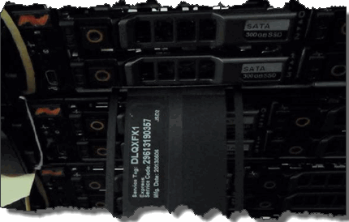

= Sostituire un telaio
:allow-uri-read: 
:icons: font
:imagesdir: ../media/

[role="lead"]
Potrebbe essere necessario sostituire lo chassis in caso di guasto della ventola, dell'unità di elaborazione centrale (CPU) o del modulo di memoria dual inline (DIMM), oppure per risolvere problemi di surriscaldamento o problemi con il processo di avvio.  Errori del cluster nell'interfaccia utente (UI) del software NetApp Element e la luce ambra lampeggiante nella parte anteriore dello chassis sono indicazioni di una possibile necessità di sostituzione dello chassis.  Prima di procedere, contattare l'assistenza NetApp .

.Cosa ti servirà
* Hai contattato l'assistenza NetApp .
+
Se si ordina una sostituzione, è necessario aprire un caso con il supporto NetApp .

* Hai ottenuto il telaio sostitutivo.
* Hai un braccialetto antistatico (ESD) o hai adottato altre misure di protezione antistatiche.
* Se devi eseguire il processo di restituzione dell'immagine di fabbrica (RTFI), hai ottenuto la chiave USB.
+
Il supporto NetApp ti aiuterà a decidere se è necessario RTFI. Vedere https://kb.netapp.com/Advice_and_Troubleshooting/Hybrid_Cloud_Infrastructure/NetApp_HCI/How_to_create_an_RTFI_key_to_re-image_a_SolidFire_storage_node["questo articolo della Knowledge Base (è richiesto l'accesso)"] .

* Hai una tastiera e un monitor.

.Informazioni su questo compito
Le istruzioni contenute in questo documento sono valide se si dispone di uno chassis con un'unità rack (1U) con uno qualsiasi dei seguenti nodi:

* SF2405
* SF4805
* SF9605
* SF9608
* SF19210
* SF38410
* SF-FCN-01
* FC0025

[NOTE]
====
A seconda della versione del software Element, i seguenti nodi non sono supportati:

* A partire dai nodi di archiviazione Element 12.8, SF4805, SF9605, SF19210 e SF38410.
* A partire dall'elemento 12.7, nodi di archiviazione SF2405 e SF9608 e nodi FC FC0025 e SF-FCN-01.
* A partire dai nodi di archiviazione Element 12.0, SF3010, SF6010 e SF9010.

====
.Passi
. Individuare l'etichetta di servizio dello chassis guasto e verificare che il numero di serie corrisponda al numero riportato sulla custodia aperta presso l'assistenza NetApp quando è stato ordinato il componente sostitutivo.
+
È possibile individuare l'etichetta di servizio nella parte anteriore del telaio.

+
La figura seguente è un esempio del tag di servizio:

+

+

NOTE: La figura sopra è un esempio.  La posizione esatta del tag di servizio potrebbe variare a seconda del modello hardware.

. Collegare la tastiera e il monitor al retro dello chassis guasto.
. Verificare le informazioni sullo chassis con il supporto NetApp .
. Spegnere il telaio.
. Etichettare le unità nella parte anteriore del telaio e i cavi nella parte posteriore.
+

NOTE: I nodi Fibre Channel non hanno unità nella parte anteriore.

. Rimuovere gli alimentatori e i cavi.
. Rimuovere le unità con cautela e posizionarle su una superficie piana e antistatica.
+

NOTE: Se si dispone di un nodo Fibre Channel, è possibile saltare questo passaggio.

. Rimuovere il telaio premendo il fermo o svitando la vite a testa zigrinata, a seconda del modello hardware.
+
Dovresti imballare e restituire lo chassis guasto a NetApp.

. *Facoltativo*: rimuovere le guide e installare quelle nuove fornite con il telaio sostitutivo.
+
È possibile scegliere di riutilizzare le rotaie esistenti.  Se si riutilizzano le rotaie esistenti, è possibile saltare questo passaggio.

. Far scorrere il telaio sostitutivo sulle guide.
. Per i nodi di archiviazione, inserire le unità dallo chassis guasto allo chassis sostitutivo.
+

NOTE: Dovresti inserire le unità negli stessi slot in cui si trovavano nello chassis guasto.

. Installare gli alimentatori.
. Inserire i cavi di alimentazione e i cavi 1GbE e 10GbE nelle rispettive porte originali.
+
I transceiver Small Form-Factor Pluggable (SFP) potrebbero essere inseriti nelle porte 10GbE dello chassis sostitutivo.  Dovresti rimuoverli prima di cablare le porte 10GbE.

. Se hai stabilito che non è necessario eseguire il processo RTFI sul nodo, avvia il nodo e attendi che venga visualizzata l'interfaccia utente del terminale (TUI).  Procedere al passaggio 16 e consentire al cluster di ricreare automaticamente l'immagine del nodo quando lo si aggiunge tramite l'interfaccia utente.
. *Facoltativo*: se il supporto NetApp consiglia di ricreare l'immagine del nodo con una chiave USB, eseguire i seguenti passaggi secondari:
+
.. Accendere il telaio.  Si avvia con l'immagine della chiave RTFI.
.. Al primo prompt, digitare *Y* per creare l'immagine del nodo di archiviazione.
.. Al secondo prompt, digitare *N* per i controlli di integrità dell'hardware.
+
Se lo script RTFI rileva un problema con un componente hardware, visualizza un errore nella console.  Se vedi un errore, contatta l'assistenza NetApp .  Una volta completato il processo RTFI, il nodo si spegne.

.. Rimuovere la chiavetta USB dallo slot USB.
.. Avviare il nodo appena creato e attendere che venga visualizzata l'interfaccia utente guidata (TUI).

. Configurare le informazioni di rete e cluster dalla TUI.
+
Per ricevere assistenza, puoi contattare il supporto NetApp .

. Aggiungere il nuovo nodo al cluster utilizzando l'interfaccia utente terminale del cluster.
. Imballare e restituire il telaio guasto.

== Trova maggiori informazioni

* https://docs.netapp.com/us-en/element-software/index.html["Documentazione del software SolidFire ed Element"]
* https://docs.netapp.com/sfe-122/topic/com.netapp.ndc.sfe-vers/GUID-B1944B0E-B335-4E0B-B9F1-E960BF32AE56.html["Documentazione per le versioni precedenti dei prodotti NetApp SolidFire ed Element"^]

