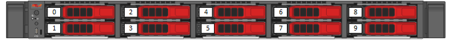
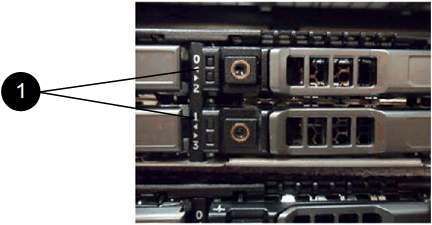

= Sostituire le unità per i nodi di archiviazione della serie SF
:allow-uri-read: 
:icons: font
:imagesdir: ../media/

[role="lead"]
È possibile sostituire a caldo un'unità a stato solido guasta con un'unità sostitutiva.

.Cosa ti servirà
* Hai un'unità sostitutiva.
* Hai un braccialetto antistatico (ESD) o hai preso altre precauzioni antistatiche.
* Hai contattato l'assistenza NetApp per verificare che l'SSD debba essere sostituito e per ricevere assistenza sulla corretta procedura di risoluzione.
+
Quando chiami l'assistenza NetApp, ti serviranno il codice di matricola o il numero di serie.  Il supporto collaborerà con te per ottenere un'unità sostitutiva in base al tuo Contratto di Servizio.

.Informazioni su questo compito
Le istruzioni si applicano ai seguenti modelli di nodi di archiviazione SolidFire :

* SF2405
* SF4805
* SF9605
* SF9608
* SF19210
* SF38410

[NOTE]
====
A seconda della versione del software Element, i seguenti nodi non sono supportati:

* A partire dai nodi di archiviazione Element 12.8, SF4805, SF9605, SF19210 e SF38410.
* A partire dall'elemento 12.7, nodi di archiviazione SF2405 e SF9608.
* A partire dai nodi di archiviazione Element 12.0, SF3010, SF6010 e SF9010.

====
La figura seguente mostra il posizionamento delle unità in uno chassis SF9605:

NOTE: La figura sopra è un esempio.  SF9608 ha una disposizione delle unità diversa che include solo otto unità numerate da uno a otto, da sinistra a destra.

Lo slot 0 contiene l'unità metadati per il nodo.  Se si sostituisce l'unità nello slot 0, è necessario applicare l'adesivo incluso nella scatola di spedizione sull'unità sostitutiva, in modo da poterla identificare separatamente dalle altre.

[NOTE]
====
Seguire queste buone pratiche durante la gestione delle unità:

* Per evitare le scariche elettrostatiche (ESD), conservare l'unità nell'apposita custodia ESD finché non si è pronti a installarla.
* Non inserire utensili metallici o coltelli nel sacchetto ESD.
* Aprire il sacchetto ESD manualmente o tagliare la parte superiore con un paio di forbici.
* Conservare la busta ESD e tutti i materiali di imballaggio nel caso in cui si debba restituire l'unità in un secondo momento.
* Indossare sempre un braccialetto antistatico collegato a una superficie non verniciata del telaio.
* Utilizzare sempre entrambe le mani quando si rimuove, si installa o si trasporta un'unità.
* Non forzare mai un'unità nello chassis.
* Non impilare le unità una sopra l'altra.
* Per la spedizione delle unità utilizzare sempre imballaggi approvati.

====
Ecco una panoramica generale dei passaggi:

* <<Rimuovere l'unità dal cluster>>
* <<Sostituire l'unità dallo chassis>>
* <<Aggiungere l'unità al cluster>>

== Rimuovere l'unità dal cluster

Il sistema SolidFire segnala un'unità in stato di errore se l'autodiagnosi dell'unità segnala al nodo che si è verificata un'anomalia o se la comunicazione con l'unità si interrompe per cinque minuti e mezzo o più.  Il sistema visualizza un elenco delle unità guaste.  È necessario rimuovere un'unità guasta dall'elenco delle unità guaste nel software NetApp Element .

.Passi
. Nell'interfaccia utente di Element, seleziona *Cluster* > *Unità*.
. Selezionare *Non riuscito* per visualizzare l'elenco delle unità non riuscite.
. Annotare il numero di slot dell'unità guasta.
+
Queste informazioni sono necessarie per individuare l'unità guasta nello chassis.

. Rimuovere l'unità guasta utilizzando uno dei seguenti metodi:
+
[cols="2*"]
|===
| Opzione | Passi 

 a| 
Per rimuovere singole unità
 a| 
.. Selezionare *Azioni* per l'unità che si desidera rimuovere.
.. Seleziona *Rimuovi*.

 a| 
Per rimuovere più unità
 a| 
.. Seleziona tutte le unità che vuoi rimuovere e seleziona *Azioni in blocco*.
.. Seleziona *Rimuovi*.

|===

== Sostituire l'unità dallo chassis

Dopo aver rimosso un'unità guasta dall'elenco delle unità guaste nell'interfaccia utente di Element, è possibile sostituirla fisicamente dallo chassis.

.Passi
. Disimballare l'unità sostitutiva e posizionarla su una superficie piana e priva di elettricità statica, vicino al rack.
+
Conservare il materiale di imballaggio per quando si restituirà l'unità guasta a NetApp.

. Abbinare il numero di slot dell'unità guasta dall'interfaccia utente di Element con il numero sullo chassis.
+
La figura seguente è un esempio per mostrare la numerazione degli slot delle unità:

+

+
[cols="2*"]
|===
| Articolo | Descrizione 

 a| 
1
 a| 
Numeri degli slot dell'unità

|===
. Premere il cerchio rosso sull'unità che si desidera rimuovere per sbloccarla.
+
Il fermo si apre con uno scatto.

. Estrarre l'unità dallo chassis e posizionarla su una superficie piana e priva di elettricità statica.
. Premere il cerchio rosso sull'unità sostitutiva prima di inserirla nello slot.
. Inserire l'unità sostitutiva e premere il cerchio rosso per chiudere il fermo.
. Informare il supporto NetApp della sostituzione dell'unità.
+
Il supporto NetApp fornirà istruzioni per la restituzione dell'unità guasta.

== Aggiungere l'unità al cluster

Dopo aver installato una nuova unità nello chassis, questa viene registrata come disponibile.  È necessario aggiungere l'unità al cluster tramite l'interfaccia utente di Element prima che possa partecipare al cluster.

.Passi
. Nell'interfaccia utente di Element, fare clic su *Cluster* > *Unità*.
. Fare clic su *Disponibile* per visualizzare l'elenco delle unità disponibili.
. Per aggiungere unità, seleziona una delle seguenti opzioni:
+
[cols="2*"]
|===
| Opzione | Passi 

 a| 
Per aggiungere singole unità
 a| 
.. Selezionare il pulsante *Azioni* per l'unità che si desidera aggiungere.
.. Selezionare *Aggiungi*.

 a| 
Per aggiungere più unità
 a| 
.. Selezionare le caselle di controllo delle unità da aggiungere, quindi selezionare *Azioni in blocco*.
.. Selezionare *Aggiungi*.

|===

== Trova maggiori informazioni

* https://docs.netapp.com/us-en/element-software/index.html["Documentazione del software SolidFire ed Element"]
* https://docs.netapp.com/sfe-122/topic/com.netapp.ndc.sfe-vers/GUID-B1944B0E-B335-4E0B-B9F1-E960BF32AE56.html["Documentazione per le versioni precedenti dei prodotti NetApp SolidFire ed Element"^]

