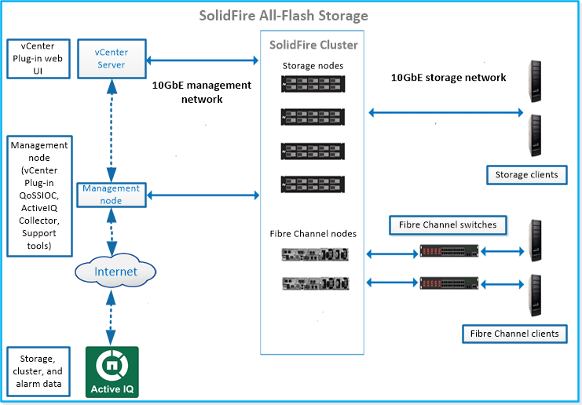

= Sistema di archiviazione SolidFire
:allow-uri-read: 
:icons: font
:imagesdir: ../media/

[role="lead"]
Un sistema di storage all-flash SolidFire è composto da componenti hardware discreti (unità e nodi) che vengono combinati in un unico pool di risorse di storage tramite il software NetApp Element eseguito in modo indipendente su ciascun nodo.  Questo cluster unificato si presenta come un singolo sistema di archiviazione utilizzabile da client esterni ed è gestito come un'unica entità tramite l'interfaccia utente del software Element, l'API e altri strumenti di gestione.

Utilizzando l'interfaccia utente del software NetApp Element , è possibile configurare e monitorare la capacità e le prestazioni di storage del cluster SolidFire e gestire l'attività di storage in un'infrastruttura multi-tenant.

Un sistema di archiviazione all-flash SolidFire include i seguenti componenti:

* Nodi: hardware fisico che fornisce le risorse di archiviazione per un cluster.  Esistono due tipi di nodi:
+
** Nodi di archiviazione: server contenenti una raccolta di unità.
** Nodi Fibre Channel (FC): utilizzati per connettere i client FC tramite uno switch Fibre Channel.

* Cluster: l'hub del sistema di archiviazione SolidFire composto da almeno quattro nodi.
* Nodo di gestione: consente di aggiornare e fornire servizi di sistema, tra cui monitoraggio e telemetria, gestire risorse e impostazioni del cluster, eseguire test e utilità di sistema e fornire l'accesso al supporto NetApp per la risoluzione dei problemi.  Il nodo di gestione (mNode) è una macchina virtuale che viene eseguita in tandem con un cluster di archiviazione basato sul software Element.
* Active IQ: uno strumento basato sul Web che fornisce visualizzazioni storiche costantemente aggiornate dei dati dell'intero cluster.  È possibile impostare avvisi per eventi, soglie o metriche specifici.  Active IQ consente di monitorare le prestazioni e la capacità del sistema, nonché di rimanere informati sullo stato di salute del cluster.
* Le unità vengono utilizzate nei nodi di archiviazione e memorizzano i dati per il cluster.  Un nodo di archiviazione contiene due tipi di unità:
+
** Le unità metadati del volume archiviano informazioni che definiscono i volumi e altri oggetti all'interno di un cluster.
** Le unità a blocchi memorizzano blocchi di dati per i volumi delle applicazioni.

