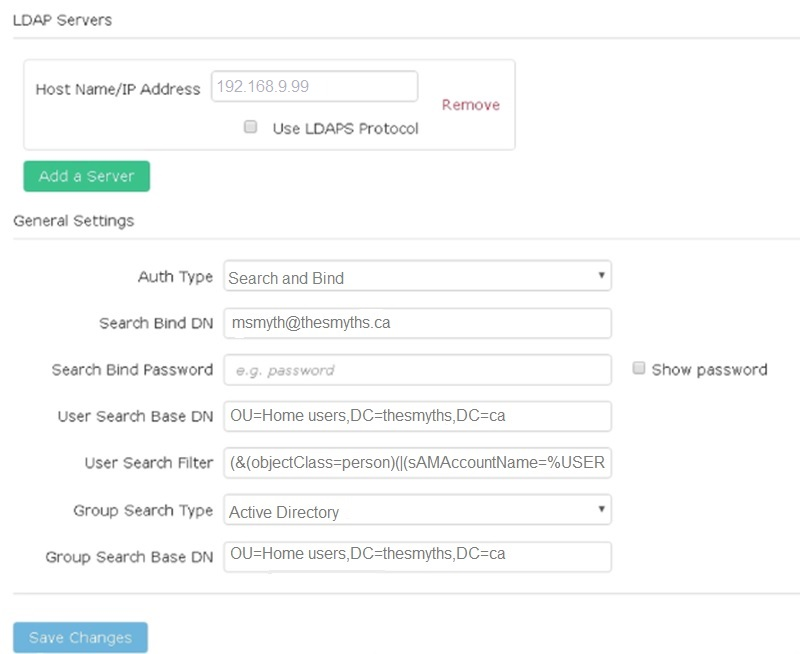
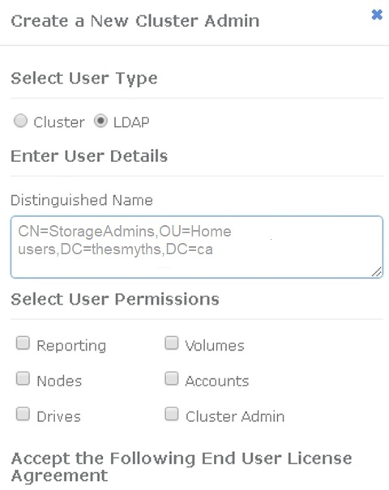

= Gestisci LDAP
:allow-uri-read: 
:icons: font
:imagesdir: ../media/

[role="lead"]
È possibile configurare il protocollo LDAP (Lightweight Directory Access Protocol) per abilitare la funzionalità di accesso sicura basata su directory allo storage SolidFire .  È possibile configurare LDAP a livello di cluster e autorizzare utenti e gruppi LDAP.

La gestione di LDAP implica la configurazione dell'autenticazione LDAP su un cluster SolidFire utilizzando un ambiente Microsoft Active Directory esistente e il test della configurazione.

NOTE: È possibile utilizzare sia indirizzi IPv4 che IPv6.

L'abilitazione di LDAP prevede i seguenti passaggi generali, descritti in dettaglio:

. *Completare i passaggi di preconfigurazione per il supporto LDAP*.  Verificare di disporre di tutti i dettagli necessari per configurare l'autenticazione LDAP.
. *Abilita l'autenticazione LDAP*.  Utilizzare l'interfaccia utente Element o l'API Element.
. *Convalidare la configurazione LDAP*.  Facoltativamente, verificare che il cluster sia configurato con i valori corretti eseguendo il metodo API GetLdapConfiguration o controllando la configurazione LCAP tramite l'interfaccia utente dell'elemento.
. *Testare l'autenticazione LDAP* (con `readonly` utente).  Verificare che la configurazione LDAP sia corretta eseguendo il metodo API TestLdapAuthentication oppure utilizzando l'interfaccia utente dell'elemento.  Per questo test iniziale, utilizzare il nome utente "`sAMAccountName`" del `readonly` utente.  Ciò convaliderà che il cluster è configurato correttamente per l'autenticazione LDAP e convaliderà anche che `readonly` le credenziali e l'accesso sono corretti.  Se questo passaggio non riesce, ripetere i passaggi da 1 a 3.
. *Testa l'autenticazione LDAP* (con un account utente che desideri aggiungere).  Ripetere la procedura descritta al punto 4 con un account utente che si desidera aggiungere come amministratore del cluster Element.  Copia il `distinguished` nome (DN) o l'utente (o il gruppo).  Questo DN verrà utilizzato nel passaggio 6.
. *Aggiungere l'amministratore del cluster LDAP* (copiare e incollare il DN dal passaggio di autenticazione LDAP di prova).  Utilizzando l'interfaccia utente Element o il metodo API AddLdapClusterAdmin, creare un nuovo utente amministratore del cluster con il livello di accesso appropriato.  Per il nome utente, incolla il DN completo che hai copiato nel passaggio 5.  Ciò garantisce che il DN sia formattato correttamente.
. *Testare l'accesso dell'amministratore del cluster*.  Accedere al cluster utilizzando l'utente amministratore del cluster LDAP appena creato.  Se hai aggiunto un gruppo LDAP, puoi accedere come qualsiasi utente di quel gruppo.

== Completare i passaggi di preconfigurazione per il supporto LDAP

Prima di abilitare il supporto LDAP in Element, è necessario configurare un server Windows Active Directory ed eseguire altre attività di preconfigurazione.

.Passi
. Configurare un server Windows Active Directory.
. *Facoltativo:* abilitare il supporto LDAPS.
. Crea utenti e gruppi.
. Creare un account di servizio di sola lettura (ad esempio "`sfreadonly`") da utilizzare per la ricerca nella directory LDAP.

== Abilita l'autenticazione LDAP con l'interfaccia utente Element

È possibile configurare l'integrazione del sistema di archiviazione con un server LDAP esistente.  Ciò consente agli amministratori LDAP di gestire centralmente l'accesso degli utenti al sistema di archiviazione.

È possibile configurare LDAP tramite l'interfaccia utente Element o tramite l'API Element.  Questa procedura descrive come configurare LDAP utilizzando l'interfaccia utente Element.

Questo esempio mostra come configurare l'autenticazione LDAP su SolidFire e utilizza `SearchAndBind` come tipo di autenticazione.  Nell'esempio viene utilizzato un singolo server Active Directory Windows Server 2012 R2.

.Passi
. Fare clic su *Cluster* > *LDAP*.
. Fare clic su *Sì* per abilitare l'autenticazione LDAP.
. Fare clic su *Aggiungi un server*.
. Inserisci *Nome host/Indirizzo IP*.
+

NOTE: È anche possibile immettere un numero di porta personalizzato facoltativo.

+
Ad esempio, per aggiungere un numero di porta personalizzato, immettere <nome host o indirizzo IP>:<numero di porta>

. *Facoltativo:* seleziona *Usa protocollo LDAPS*.
. Inserisci le informazioni richieste in *Impostazioni generali*.
+

. Fare clic su *Abilita LDAP*.
. Fare clic su *Test autenticazione utente* se si desidera testare l'accesso al server per un utente.
. Copiare il nome distinto e le informazioni sul gruppo utente che vengono visualizzate per utilizzarle in seguito durante la creazione degli amministratori del cluster.
. Fare clic su *Salva modifiche* per salvare le nuove impostazioni.
. Per creare un utente in questo gruppo in modo che chiunque possa accedere, completa quanto segue:
+
.. Fare clic su *Utente* > *Visualizza*.
+

.. Per il nuovo utente, fare clic su *LDAP* per Tipo utente e incollare il gruppo copiato nel campo Nome distinto.
.. Selezionare le autorizzazioni, in genere tutte le autorizzazioni.
.. Scorri verso il basso fino al Contratto di licenza con l'utente finale e fai clic su *Accetto*.
.. Fare clic su *Crea amministratore cluster*.
+
Ora hai un utente con il valore di un gruppo Active Directory.

Per testarlo, disconnettiti dall'interfaccia utente di Element e accedi nuovamente come utente di quel gruppo.

== Abilita l'autenticazione LDAP con l'API Element

È possibile configurare l'integrazione del sistema di archiviazione con un server LDAP esistente.  Ciò consente agli amministratori LDAP di gestire centralmente l'accesso degli utenti al sistema di archiviazione.

È possibile configurare LDAP tramite l'interfaccia utente Element o tramite l'API Element.  Questa procedura descrive come configurare LDAP utilizzando l'API Element.

Per sfruttare l'autenticazione LDAP su un cluster SolidFire , abilitare prima l'autenticazione LDAP sul cluster utilizzando `EnableLdapAuthentication` Metodo API.

.Passi
. Abilitare prima l'autenticazione LDAP sul cluster utilizzando `EnableLdapAuthentication` Metodo API.
. Inserisci le informazioni richieste.
+
[listing]
----
{
     "method":"EnableLdapAuthentication",
     "params":{
          "authType": "SearchAndBind",
          "groupSearchBaseDN": "dc=prodtest,dc=solidfire,dc=net",
          "groupSearchType": "ActiveDirectory",
          "searchBindDN": "SFReadOnly@prodtest.solidfire.net",
          "searchBindPassword": "ReadOnlyPW",
          "userSearchBaseDN": "dc=prodtest,dc=solidfire,dc=net ",
          "userSearchFilter": "(&(objectClass=person)(sAMAccountName=%USERNAME%))"
          "serverURIs": [
               "ldap://172.27.1.189",
          [
     },
  "id":"1"
}
----
. Modificare i valori dei seguenti parametri:
+
[cols="2*"]
|===
| Parametri utilizzati | Descrizione 

 a| 
authType: SearchAndBind
 a| 
Stabilisce che il cluster utilizzerà l'account di servizio di sola lettura per cercare prima l'utente da autenticare e successivamente associare tale utente se trovato e autenticato.

 a| 
groupSearchBaseDN: dc=prodtest,dc=solidfire,dc=net
 a| 
Specifica la posizione nell'albero LDAP da cui iniziare la ricerca dei gruppi.  Per questo esempio abbiamo utilizzato la radice del nostro albero.  Se l'albero LDAP è molto grande, potrebbe essere opportuno impostarlo su un sottoalbero più granulare per ridurre i tempi di ricerca.

 a| 
userSearchBaseDN: dc=prodtest,dc=solidfire,dc=net
 a| 
Specifica la posizione nell'albero LDAP da cui iniziare la ricerca degli utenti.  Per questo esempio abbiamo utilizzato la radice del nostro albero.  Se l'albero LDAP è molto grande, potrebbe essere opportuno impostarlo su un sottoalbero più granulare per ridurre i tempi di ricerca.

 a| 
groupSearchType: ActiveDirectory
 a| 
Utilizza il server Windows Active Directory come server LDAP.

 a| 
[listing]
----
userSearchFilter:
“(&(objectClass=person)(sAMAccountName=%USERNAME%))”
----
Per utilizzare userPrincipalName (indirizzo email per l'accesso) puoi modificare userSearchFilter in:

[listing]
----
“(&(objectClass=person)(userPrincipalName=%USERNAME%))”
----
In alternativa, per cercare sia userPrincipalName che sAMAccountName, è possibile utilizzare il seguente userSearchFilter:

[listing]
----
“(&(objectClass=person)(
----| (sAMAccountName=%USERNAME%)(userPrincipalName=%USERNAME%)))” ---- 

 a| 
Utilizza sAMAccountName come nome utente per accedere al cluster SolidFire .  Queste impostazioni indicano a LDAP di cercare il nome utente specificato durante l'accesso nell'attributo sAMAccountName e di limitare la ricerca alle voci che hanno "`person`" come valore nell'attributo objectClass.
 a| 
searchBindDN

 a| 
Questo è il nome distinto dell'utente di sola lettura che verrà utilizzato per cercare nella directory LDAP.  Per Active Directory è solitamente più semplice utilizzare userPrincipalName (formato indirizzo email) per l'utente.
 a| 
cercaBindPassword

|===

Per testarlo, disconnettiti dall'interfaccia utente di Element e accedi nuovamente come utente di quel gruppo.

== Visualizza i dettagli LDAP

Visualizzare le informazioni LDAP nella pagina LDAP nella scheda Cluster.

NOTE: Per visualizzare queste impostazioni di configurazione LDAP è necessario abilitare LDAP.

. Per visualizzare i dettagli LDAP con l'interfaccia utente Element, fare clic su *Cluster* > *LDAP*.
+
** *Nome host/Indirizzo IP*: Indirizzo di un server di directory LDAP o LDAPS.
** *Tipo di autenticazione*: metodo di autenticazione dell'utente. Valori possibili:
+
*** Legame diretto
*** Cerca e collega

** *DN di binding di ricerca*: un DN completamente qualificato con cui effettuare l'accesso per eseguire una ricerca LDAP per l'utente (richiede l'accesso a livello di binding alla directory LDAP).
** *Cerca password di associazione*: password utilizzata per autenticare l'accesso al server LDAP.
** *DN base ricerca utente*: il DN base dell'albero utilizzato per avviare la ricerca utente.  Il sistema esegue la ricerca nel sottoalbero dalla posizione specificata.
** *Filtro di ricerca utente*: inserisci quanto segue utilizzando il tuo nome di dominio:
+
`(&(objectClass=person)(|(sAMAccountName=%USERNAME%)(userPrincipalName=%USERNAME%)))`

** *Tipo di ricerca di gruppo*: tipo di ricerca che controlla il filtro di ricerca di gruppo predefinito utilizzato. Valori possibili:
+
*** Active Directory: appartenenza nidificata di tutti i gruppi LDAP di un utente.
*** Nessun gruppo: nessun supporto di gruppo.
*** Membro DN: gruppi in stile Membro DN (livello singolo).

** *DN base ricerca gruppo*: il DN base dell'albero utilizzato per avviare la ricerca di gruppo.  Il sistema esegue la ricerca nel sottoalbero dalla posizione specificata.
** *Test di autenticazione utente*: dopo aver configurato LDAP, utilizzare questa opzione per testare l'autenticazione del nome utente e della password per il server LDAP.  Inserisci un account già esistente per testarlo.  Vengono visualizzate le informazioni sul nome distinto e sul gruppo utente, che è possibile copiare per un utilizzo successivo durante la creazione degli amministratori del cluster.

== Testare la configurazione LDAP

Dopo aver configurato LDAP, dovresti testarlo utilizzando l'interfaccia utente Element o l'API Element `TestLdapAuthentication` metodo.

.Passi
. Per testare la configurazione LDAP con Element UI, procedere come segue:
+
.. Fare clic su *Cluster* > *LDAP*.
.. Fare clic su *Test autenticazione LDAP*.
.. Risolvi eventuali problemi utilizzando le informazioni nella tabella sottostante:
+
[cols="2*"]
|===
| Messaggio di errore | Descrizione 

 a| 
 xLDAPUserNotFound a| 
*** L'utente sottoposto a test non è stato trovato nella configurazione `userSearchBaseDN` sottoalbero.
*** IL `userSearchFilter` è configurato in modo errato.

 a| 
 xLDAPBindFailed (Error: Invalid credentials) a| 
*** Il nome utente testato è un utente LDAP valido, ma la password fornita non è corretta.
*** Il nome utente testato è un utente LDAP valido, ma l'account è attualmente disabilitato.

 a| 
 xLDAPSearchBindFailed (Error: Can't contact LDAP server) a| 
L'URI del server LDAP non è corretto.

 a| 
 xLDAPSearchBindFailed (Error: Invalid credentials) a| 
Il nome utente o la password di sola lettura non sono configurati correttamente.

 a| 
 xLDAPSearchFailed (Error: No such object) a| 
IL `userSearchBaseDN` non è una posizione valida all'interno dell'albero LDAP.

 a| 
 xLDAPSearchFailed (Error: Referral) a| 
*** IL `userSearchBaseDN` non è una posizione valida all'interno dell'albero LDAP.
*** IL `userSearchBaseDN` E `groupSearchBaseDN` si trovano in una OU annidata.  Ciò può causare problemi di autorizzazione.  La soluzione alternativa è quella di includere l'OU nelle voci DN di base dell'utente e del gruppo (ad esempio: `ou=storage, cn=company, cn=com` )

|===

. Per testare la configurazione LDAP con l'API Element, procedere come segue:
+
.. Chiamare il metodo TestLdapAuthentication.
+
[listing]
----
{
  "method":"TestLdapAuthentication",
     "params":{
        "username":"admin1",
        "password":"admin1PASS
      },
      "id": 1
}
----
.. Esaminare i risultati.  Se la chiamata API ha esito positivo, i risultati includono il nome distinto dell'utente specificato e un elenco dei gruppi di cui l'utente è membro.
+
[listing]
----
{
"id": 1
     "result": {
         "groups": [
              "CN=StorageMgmt,OU=PTUsers,DC=prodtest,DC=solidfire,DC=net"
         ],
         "userDN": "CN=Admin1 Jones,OU=PTUsers,DC=prodtest,DC=solidfire,DC=net"
     }
}
----

== Disabilitare LDAP

È possibile disattivare l'integrazione LDAP tramite l'interfaccia utente di Element.

Prima di iniziare, è opportuno annotare tutte le impostazioni di configurazione, poiché disabilitando LDAP tutte le impostazioni vengono cancellate.

.Passi
. Fare clic su *Cluster* > *LDAP*.
. Fare clic su *No*.
. Fare clic su *Disabilita LDAP*.

== Trova maggiori informazioni

* https://docs.netapp.com/us-en/element-software/index.html["Documentazione del software SolidFire ed Element"]
* https://docs.netapp.com/us-en/vcp/index.html["Plug-in NetApp Element per vCenter Server"^]

