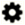
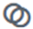
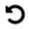

= Icone nell'interfaccia Element
:allow-uri-read: 
:icons: font
:imagesdir: ../media/

[role="lead"]
L'interfaccia del software NetApp Element visualizza icone che rappresentano le azioni che è possibile intraprendere sulle risorse di sistema.

La seguente tabella fornisce un rapido riferimento:

|===

| Icona | Descrizione 

 a| 

 a| 
Azioni

 a| 

 a| 
Backup su

 a| 

 a| 
Clona o copia

 a| 

 a| 
Elimina o elimina

 a| 

 a| 
Modificare

 a| 

 a| 
Filtro

 a| 

 a| 
Paio

 a| 

 a| 
Aggiorna

 a| 

 a| 
Ripristinare

 a| 

 a| 
Ripristina da

 a| 

 a| 
Ripristino

 a| 

 a| 
Istantanea

|===