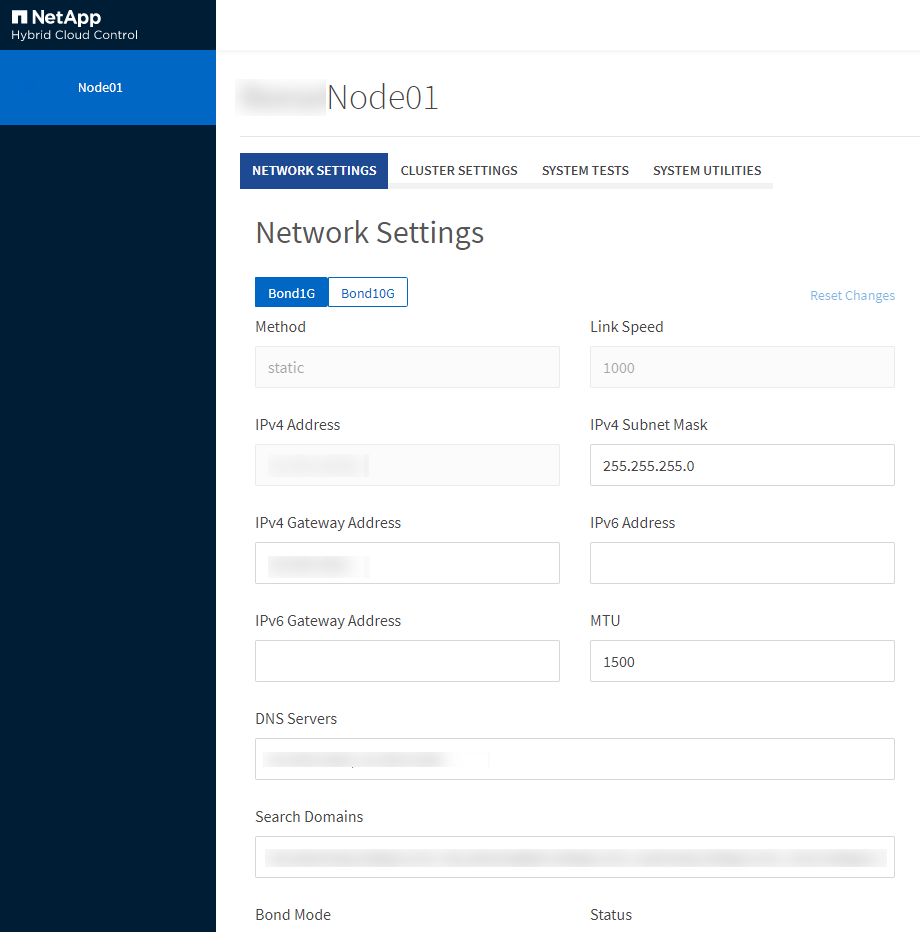

= Accedi alle impostazioni per nodo tramite l'interfaccia utente per nodo
:allow-uri-read: 
:icons: font
:imagesdir: ../media/

[role="lead"]
È possibile accedere alle impostazioni di rete, alle impostazioni del cluster, ai test e alle utilità di sistema nell'interfaccia utente per nodo dopo aver immesso l'IP del nodo di gestione ed eseguito l'autenticazione.

Se si desidera modificare le impostazioni di un nodo in stato Attivo che fa parte di un cluster, è necessario accedere come utente amministratore del cluster.

TIP: Dovresti configurare o modificare un nodo alla volta.  Prima di apportare modifiche a un altro nodo, è necessario assicurarsi che le impostazioni di rete specificate abbiano l'effetto previsto e che la rete sia stabile e funzioni correttamente.

. Aprire l'interfaccia utente per nodo utilizzando uno dei seguenti metodi:
+
** Inserisci l'indirizzo IP di gestione seguito da :442 in una finestra del browser ed effettua l'accesso utilizzando un nome utente e una password amministratore.
** Nell'interfaccia utente dell'elemento, seleziona *Cluster* > *Nodi* e fai clic sul collegamento all'indirizzo IP di gestione per il nodo che desideri configurare o modificare.  Nella finestra del browser che si apre, puoi modificare le impostazioni del nodo.

+

