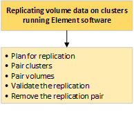

= Eseguire la replica remota tra cluster che eseguono il software NetApp Element
:allow-uri-read: 
:icons: font
:imagesdir: ../media/

[role="lead"]
Per i cluster che eseguono il software Element, la replica in tempo reale consente la rapida creazione di copie remote dei dati del volume.  È possibile associare un cluster di archiviazione a un massimo di altri quattro cluster di archiviazione.  È possibile replicare i dati del volume in modo sincrono o asincrono da entrambi i cluster in una coppia di cluster per scenari di failover e failback.

Il processo di replicazione comprende i seguenti passaggi:

* link:task_replication_plan_cluster_and_volume_pairing.html["Pianifica l'associazione di cluster e volumi per la replica in tempo reale"]
* link:task_replication_pair_clusters.html["Cluster di coppie per la replicazione"]
* link:task_replication_pair_volumes.html["Volumi di coppia"]
* link:task_replication_validate_volume_replication.html["Convalida la replica del volume"]
* link:task_replication_delete_volume_relationship_after_replication.html["Elimina una relazione di volume dopo la replica"]
* link:task_replication_manage_volume_relationships.html["Gestire le relazioni di volume"]

